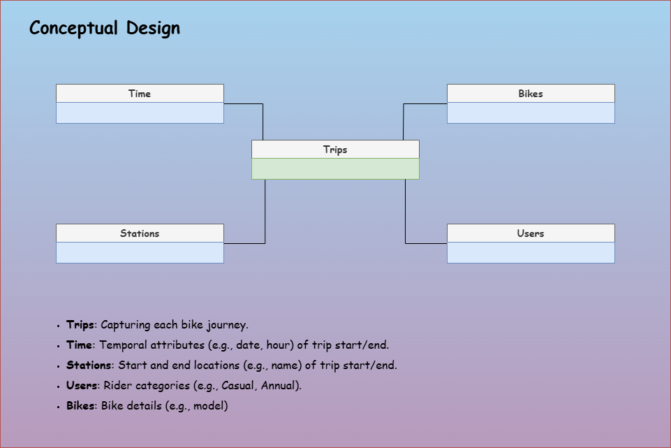

# Toronto Bike Share Data Warehouse Documentation - Conceptual Design

[Back](../../../../README.md)

- [Toronto Bike Share Data Warehouse Documentation - Conceptual Design](#toronto-bike-share-data-warehouse-documentation---conceptual-design)
  - [Project Overview and Purpose](#project-overview-and-purpose)
  - [Business Requirements](#business-requirements)
  - [Stakeholder Identification](#stakeholder-identification)
  - [Data Profile](#data-profile)
  - [Key Performance Indicators (KPIs)](#key-performance-indicators-kpis)
  - [High-Level Entities and Relationships](#high-level-entities-and-relationships)
  - [Assumptions and Constraints](#assumptions-and-constraints)

---

## Project Overview and Purpose

- **Objective**: Develop a data warehouse to analyze Toronto’s shared bike trip data from 2019 to 2024.
- **Data Source**: Historical trip records sourced from the official Toronto bike share website.
- **Purpose**: Facilitate insights into usage patterns, station performance, and user behavior.
- **Benefits**: Enhance urban planning, optimize bike share operations, and support academic research.
- **Scope**: Deliver a platform for querying and visualizing trends to improve system efficiency.

---

## Business Requirements

- **Objective**: Provide actionable insights into the Toronto bike share system to optimize operations, station planning, and user experience through data-driven analysis.
- **Key Questions**:
  - How do bike usage and trip durations evolve across different time periods? (Supports Time dimension)
  - How does ridership vary by station location and connectivity? (Supports Stations dimension)
  - How do usage patterns differ across user types? (Supports Users dimension)
- **Example Questions**:
  - **Temporal Analysis**:
    - How does ridership change across years, months, and seasons?
    - What are the busiest hours of the day for bike trips?
    - What’s the average trip duration on weekdays vs. weekends?
    - How do special events affect trip volume?
  - **Geolocation Analysis**:
    - Which stations have the highest trip volumes annually?
    - What are the most frequent origin-destination station pairs?
    - Which stations face congestion during rush hours?
    - Are there seasonal shifts in station popularity?
  - **User-Based Analysis**:
    - How does trip volume differ between casual and annual members monthly?
    - What’s the average trip duration for casual users vs. annual members?
    - Do casual users take longer trips during holidays?
    - How do user types’ ridership trends vary by weekday vs. weekend?

---

## Stakeholder Identification

- **Description**: Recognize key users and beneficiaries of the Toronto bike share data warehouse to ensure alignment with their needs.
- **Possible Users**:
  - **Project Owner**: Leads the initiative, uses insights for research and system optimization.
  - **Urban Planners**: Leverage data to enhance city mobility and station placement.
  - **Bike Share Operators**: Utilize trends to improve fleet management and service efficiency.
  - **Data Analysts**: Query the warehouse for detailed reports and visualizations.
  - **Academic Researchers**: Explore usage patterns for studies on urban transport behavior.

---

## Data Profile

- **Description**: Outline the data foundation for the Toronto bike share data warehouse to ensure accurate analysis.
- **Data Source**: Historical trip records from the official Toronto bike share dataset, City of Toronto Open Data Portal.
- **Data Source URL**: https://open.toronto.ca/dataset/bike-share-toronto-ridership-data/
- **Data Source Last Refreshed**: October 25, 2024.
- **Dataset Time Range**: January 2019 to September 2024.
- **Dataset Format**: CSV files, zipped by year; 2019 in quarterly files, 2020–2024 in monthly files.
- **Dataset Volume**: total estimated at 20–25 million trips across 2019–2024.
- **Dataset Columns**:
  - `Trip ID`: Unique identifier for each bike trip.
  - `Trip Duration`: Length of each trip in seconds.
  - `Start Time`: Date and time of trip start (e.g., MM/DD/YYYY HH:MM).
  - `End Time`: Date and time of trip end (e.g., MM/DD/YYYY HH:MM).
  - `Start Station ID/Name`: Identifier and name of origin station.
  - `End Station ID/Name`: Identifier and name of destination station.
  - `Bike ID`: Unique identifier for each bike.
  - `User Type`: Category of rider (e.g., Casual Member, Annual Member).
  - `Model`: Bike model type (e.g., ICONIC), **included starting February 2024**.
- **Notes**: Data for 2019–January 2021 is anonymized.

---

## Key Performance Indicators (KPIs)

- **Description**: Define measurable metrics to evaluate bike share usage, station performance, and user behavior.
- **KPIs**:
  - **Trip Volume Over Time**: Total number of trips by hour, day, month, and year.
  - **Average Trip Duration**: Mean trip length in seconds across time periods and user types.
  - **Station Usage Rank**: Number of trips starting or ending at each station, ranked by volume.
  - **Peak Congestion Rate**: Percentage of trips during rush hours by station.
  - **User Type Distribution**: Proportion of trips by casual vs. annual members.
  - **Travel Flow Intensity**: Frequency of trips between station pairs.

---

## High-Level Entities and Relationships

- **Objective**: Define the core entities and their connections to support dimensional analysis of bike share data.
- **Description**:
  - The data warehouse adopts a `star schema` with a central fact entity,
  - "Trips," linked to four dimension entities: "Time," "Stations," "Users," and "Bikes."
  - This structure enables temporal, geolocation, and user-based analysis.

---

## Assumptions and Constraints

- **Description**: Identify key assumptions and limitations shaping the Toronto bike share data warehouse design.
- **Assumptions**:
  - Station IDs and names remain consistent across 2019–2024.
  - Trip data accurately reflects actual usage without significant gaps.
  - User Type categories (Casual, Annual) are uniformly applied over time.
- **Constraints**:
  - Limited to historical data (January 2019–September 2024), no real-time updates.
  - Anonymized data for 2019–January 2021 may obscure user-specific trends.
  - Bike Model data only available from February 2024 onward.
